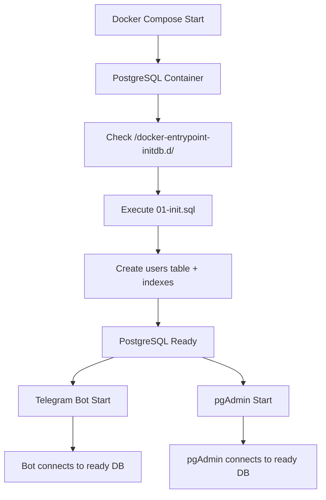

# 🗄️ Инициализация базы данных

## 🎯 Новая архитектура

Теперь база данных инициализируется **автоматически при запуске PostgreSQL**, а не через код бота.

## 📁 Структура инициализации

```
db-init/
├── 01-init.sql          # SQL скрипт создания таблиц
└── Dockerfile           # Dockerfile для инициализации (не используется)
```

## 🔄 Как это работает

### 1. **PostgreSQL автоматическая инициализация**

- При первом запуске PostgreSQL ищет SQL файлы в `/docker-entrypoint-initdb.d/`
- Выполняет их в алфавитном порядке
- Создает таблицы и индексы

### 2. **Docker Compose конфигурация**

```yaml
postgres:
  image: postgres:15-alpine
  volumes:
    - postgres-data:/var/lib/postgresql/data
    - ./db-init:/docker-entrypoint-initdb.d # ← SQL скрипты
```

### 3. **SQL скрипт (01-init.sql)**

```sql
CREATE TABLE IF NOT EXISTS users (
    id SERIAL PRIMARY KEY,
    user_id BIGINT UNIQUE NOT NULL,
    username VARCHAR(255),
    first_name VARCHAR(255),
    last_name VARCHAR(255),
    created_at TIMESTAMP DEFAULT CURRENT_TIMESTAMP
);

-- Индексы для оптимизации
CREATE INDEX IF NOT EXISTS idx_users_user_id ON users(user_id);
CREATE INDEX IF NOT EXISTS idx_users_created_at ON users(created_at);
```

## ✅ Преимущества новой архитектуры

### 🚀 **Порядок запуска**

1. **PostgreSQL** запускается первым
2. **Автоматически создает таблицы** при инициализации
3. **Telegram Bot** подключается к готовой БД
4. **pgAdmin** подключается к готовой БД

### 🔧 **Надежность**

- Таблицы создаются **до** запуска бота
- Нет зависимости от кода приложения
- Автоматическое восстановление при перезапуске

### 📈 **Производительность**

- Бот не тратит время на создание таблиц
- Быстрый старт приложения
- Оптимизированные индексы создаются сразу

### 🛠️ **Управление**

- Легко добавлять новые таблицы
- Версионирование схемы БД
- Отделение логики БД от кода приложения

## 🔄 Процесс запуска



## 📝 Добавление новых таблиц

### 1. Создать новый SQL файл

```bash
# Создать файл с номером больше текущего
touch db-init/02-new-table.sql
```

### 2. Добавить SQL код

```sql
-- db-init/02-new-table.sql
CREATE TABLE IF NOT EXISTS messages (
    id SERIAL PRIMARY KEY,
    user_id BIGINT REFERENCES users(user_id),
    message_text TEXT,
    created_at TIMESTAMP DEFAULT CURRENT_TIMESTAMP
);

CREATE INDEX IF NOT EXISTS idx_messages_user_id ON messages(user_id);
```

### 3. Перезапустить PostgreSQL

```bash
# Остановить и удалить данные
docker compose down -v

# Запустить заново (выполнит все SQL файлы)
docker compose up -d
```

## 🧪 Тестирование

### Проверка создания таблиц

```bash
# Подключиться к PostgreSQL
docker compose exec postgres psql -U postgres -d telegram_bot

# Показать все таблицы
\dt

# Показать структуру таблицы
\d users

# Показать индексы
\di
```

### Проверка через pgAdmin

1. Открыть http://localhost:5050
2. Войти: admin@admin.com / admin
3. Подключиться к серверу `postgres`
4. Проверить таблицы в `telegram_bot` → `Schemas` → `public` → `Tables`

## 🔧 Управление миграциями

### Добавить новую миграцию

```bash
# Создать файл с номером
echo "03-add-user-settings.sql" > db-init/03-add-user-settings.sql
```

### Откат изменений

```bash
# Удалить volume с данными
docker compose down -v

# Запустить заново (выполнит все миграции)
docker compose up -d
```

### Просмотр истории миграций

```bash
# Посмотреть все SQL файлы
ls -la db-init/

# Проверить порядок выполнения
ls db-init/*.sql | sort
```

## 🚨 Важные заметки

### ⚠️ **Порядок файлов**

- Файлы выполняются в **алфавитном порядке**
- Используйте префиксы: `01-`, `02-`, `03-`
- Пример: `01-init.sql`, `02-users.sql`, `03-indexes.sql`

### ⚠️ **Идемпотентность**

- Всегда используйте `CREATE TABLE IF NOT EXISTS`
- Всегда используйте `CREATE INDEX IF NOT EXISTS`
- Скрипты должны быть безопасными для повторного выполнения

### ⚠️ **Удаление данных**

```bash
# ОСТОРОЖНО: Удаляет все данные
docker compose down -v
```

## 📊 Сравнение подходов

| Параметр              | Старый подход   | Новый подход                 |
| --------------------- | --------------- | ---------------------------- |
| **Создание таблиц**   | В коде бота     | При инициализации PostgreSQL |
| **Порядок запуска**   | Бот → БД        | БД → Бот                     |
| **Надежность**        | Зависит от кода | Независимо от кода           |
| **Управление схемой** | В коде Go       | В SQL файлах                 |
| **Версионирование**   | Сложно          | Просто (файлы)               |
| **Откат**             | Сложно          | Просто                       |

## 🎯 Результат

✅ **База данных готова до запуска бота**  
✅ **Автоматическое создание таблиц и индексов**  
✅ **Простое управление схемой БД**  
✅ **Надежный порядок запуска сервисов**  
✅ **Легкое добавление новых таблиц**
